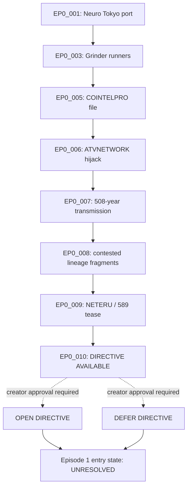

# Episode 0 Interactive Graph

## Authority and state

The episode has one author-declared interactive handoff: `DIRECTIVE AVAILABLE.` The existence of a directive is `AUTHOR_DECLARED_CANON`; its choices and consequences are currently `PROVISIONAL_CANON` because the creator has not locked them.

## Node contract

| Node | Status | Trigger | State mutation | Canon effect |
| --- | --- | --- | --- | --- |
| `EP0_DIRECTIVE_001` | `AUTHOR_DECLARED_CANON` | Completion of `EP0_010`. | Exposes an interaction affordance. | None until a choice is approved. |
| `OPEN_DIRECTIVE` | `PROVISIONAL_CANON` | Viewer opens the affordance. | May reveal choices; exact content unresolved. | Must not rewrite the fixed Episode 0 sequence. |
| `DEFER_DIRECTIVE` | `PROVISIONAL_CANON` | Viewer declines or times out. | Preserves an unresolved directive. | Must rejoin the same approved Episode 1 entry state. |

`OPEN DIRECTIVE` and `DEFER DIRECTIVE` are functional labels, not locked on-screen copy. No faction choice, moral judgment, tracking action, or canonical outcome may be invented before creator approval.

## Decisions required

1. Lock the on-screen directive choices and exact copy.
2. Decide whether the choice is canonical, perspective-only, or non-canon.
3. Define saved state, timeout behavior, replay behavior, and Episode 1 rejoin state.
4. Approve ATVNETWORK interface typography, sound, accessibility behavior, and platform implementation.
5. Decide whether ATV mini-episodes expose the directive or end before it.
